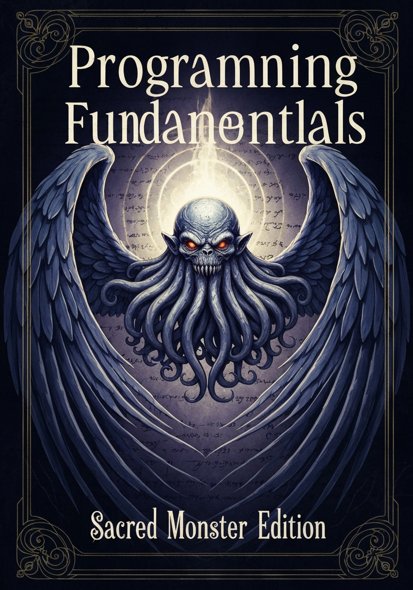

# Fundamentos de Programação

<div align="center">

</div>

> **⚠️ Disclaimer:** Este conteúdo está sendo gerado com auxílio de inteligência artificial e encontra-se em desenvolvimento ativo (work in progress). O material pode ser atualizado, revisado ou expandido a qualquer momento.

Este repositório contém material didático sobre os fundamentos que conectam eletrônica, sistemas digitais e programação, fornecendo uma base sólida para entender como funcionam os computadores modernos.

---

## 📚 Estrutura do Conteúdo

### 🔌 **[Fundamentos de Eletrônica e Programação](./chapters/introducao.md)**

Conceitos fundamentais que conectam a eletrônica física com a programação de computadores.

**Conteúdo abordado:**

- **Parte I:** Fundamentos da Eletrônica (Elétrica vs Eletrônica, Semicondutores)
- **Parte II:** Sistemas Numéricos e Representação Digital
- **Parte III:** Sistemas Digitais (Analógico vs Digital, Sincronização)
- **Parte IV:** Lógica Digital e Processamento (Portas Lógicas, ALU)
- **Parte V:** Software e Sistemas Operacionais (Compilação, Drivers)

### 💻 **[Interfaces de Usuário e Terminal](./chapters/interfaces-terminal.md)**

Guia completo sobre interfaces de usuário e uso prático do terminal.

**Conteúdo abordado:**

- Terminal vs Interface Gráfica
- Comandos básicos do macOS/Unix
- Conceitos avançados (variáveis, histórico, permissões)
- Automatização e scripts
- Ferramentas de produtividade
- **Personalização do Terminal (.zshrc)**

### 🔀 **[Controle de Versão com Git](./chapters/git-controle-versao.md)**

Guia completo sobre Git, o sistema de controle de versão mais usado no desenvolvimento.

**Conteúdo abordado:**

- Conceitos fundamentais (repositório, commit, branch)
- Comandos básicos e fluxo de trabalho
- Colaboração e repositórios remotos
- Resolução de conflitos e problemas comuns
- Boas práticas e organização
- **Comandos de referência rápida**

### 🌐 **[GitHub e Repositórios Remotos](./chapters/github-repositorios-remotos.md)**

Conexão entre Git local e plataformas de hospedagem remota como GitHub.

**Conteúdo abordado:**

- GitHub vs Git (conceitos e diferenças)
- Protocolos de conexão: HTTPS vs SSH
- Configuração de chaves SSH
- Personal Access Tokens
- Gerenciamento de remotes
- Fluxo prático completo
- **Solução de problemas comuns**

### 🐍 **[Exemplos Práticos em Diferentes Linguagens](./chapters/exemplos-praticos-linguagens.md)**

Programas simples implementados em diversas linguagens de programação.

**Conteúdo abordado:**

- Programa de saudação personalizada
- Sintaxe básica e entrada/saída
- Python (implementado)
- Comparação entre linguagens
- **Exemplos expandíveis**

### 📊 **[Tabela de Conversão entre Sistemas Numéricos](./chapters/tabela-conversao-sistemas.md)**

Referência completa para conversões entre decimal, binário e hexadecimal.

**Conteúdo abordado:**

- Tabela completa de 0 a 255 (0x00 a 0xFF)
- Conversões entre sistemas numéricos
- Padrões e relacionamentos
- Notação em programação

---

## 🎯 Objetivos do Material

Este material foi desenvolvido para:

1. **Conectar teoria e prática** → Desde componentes físicos até software
2. **Estabelecer fundamentos sólidos** → Base para estudos avançados
3. **Fornecer referências práticas** → Comandos e tabelas de uso frequente
4. **Facilitar a compreensão** → Linguagem acessível e exemplos práticos

---

## 🚀 Como Usar Este Material

### **Para Iniciantes:**

1. Comece com **[Fundamentos de Eletrônica e Programação](./chapters/introducao.md)**
2. Use a **[Tabela de Conversão](./chapters/tabela-conversao-sistemas.md)** como referência
3. Pratique com **[Interfaces e Terminal](./chapters/interfaces-terminal.md)**

### **Para Referência:**

- **Conversões numéricas** → Consulte a tabela completa
- **Comandos do terminal** → Seções 2-6 do guia de interfaces
- **Personalização** → Seção 7 do guia de interfaces

### **Para Estudo:**

- Leia sequencialmente o documento principal
- Experimente os comandos práticos
- Personalize seu ambiente de desenvolvimento

---

## 📖 Pré-requisitos

- **Conhecimento básico** de matemática
- **Acesso a um terminal** (macOS, Linux ou WSL no Windows)
- **Curiosidade** sobre como funcionam os computadores

---

## 🛠️ Ferramentas Necessárias

- **Terminal/Shell** (zsh, bash)
- **Editor de texto** (nano, vim, VS Code)
- **Git** (para controle de versão)

---

## 📝 Estrutura dos Arquivos

```
fundamentos-prog/
├── README.md                          # Este arquivo
├── chapters/
│   ├── introducao.md                  # Documento principal
│   ├── interfaces-terminal.md         # Guia do terminal
│   ├── git-controle-versao.md         # Guia do Git
│   └── tabela-conversao-sistemas.md   # Tabela de referência
└── images/
    ├── res-cap-ind.png               # Componentes elétricos
    ├── dio-trans.png                 # Componentes eletrônicos
    ├── alu.png                       # Diagrama da ALU
    └── book_cover.png                # Capa do livro
```

    └── alu.png                       # Diagrama da ALU

```

---

## 🔗 Links Rápidos

### Documentos Principais

- **[📖 Introdução Completa](./chapters/introducao.md)** - Fundamentos de eletrônica e programação
- **[💻 Terminal e Interfaces](./chapters/interfaces-terminal.md)** - Guia prático do terminal
- **[� Controle de Versão Git](./chapters/git-controle-versao.md)** - Sistema de versionamento
- **[�📊 Tabela de Conversão](./chapters/tabela-conversao-sistemas.md)** - Sistemas numéricos

### Seções Específicas

- **[Eletrônica vs Elétrica](./chapters/introducao.md#11-elétrica-vs-eletrônica)**
- **[Sistemas Numéricos](./chapters/introducao.md#parte-ii-sistemas-numéricos-e-representação-digital)**
- **[Portas Lógicas](./chapters/introducao.md#41-portas-lógicas---os-blocos-básicos)**
- **[Comandos Básicos](./chapters/interfaces-terminal.md#2-comandos-básicos-do-terminal-macosunix)**
- **[Personalização do zshrc](./chapters/interfaces-terminal.md#7-personalização-básica-do-terminal-zshrc)**
- **[Comandos Git Essenciais](./chapters/git-controle-versao.md#71-comandos-essenciais)**
- **[Fluxo de Trabalho Git](./chapters/git-controle-versao.md#43-fluxo-básico-de-trabalho)**

---

## 🎓 Próximos Passos

Após dominar este material, você estará preparado para:

- **Programação de baixo nível** (Assembly, C)
- **Desenvolvimento de sistemas embarcados**
- **Arquitetura de computadores**
- **Sistemas operacionais**
- **Redes de computadores**

---

## 📄 Licença

Este material é de uso educacional livre. Sinta-se à vontade para usar, modificar e compartilhar para fins de aprendizado.

---

## 🤝 Contribuições

Sugestões de melhoria são bem-vindas! Se encontrar erros ou tiver ideias para expandir o conteúdo, abra uma issue ou envie um pull request.

---

**📚 Bons estudos e welcome to the world of computing fundamentals!** 🚀
```
