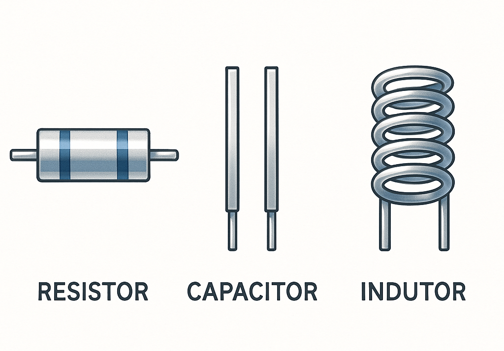
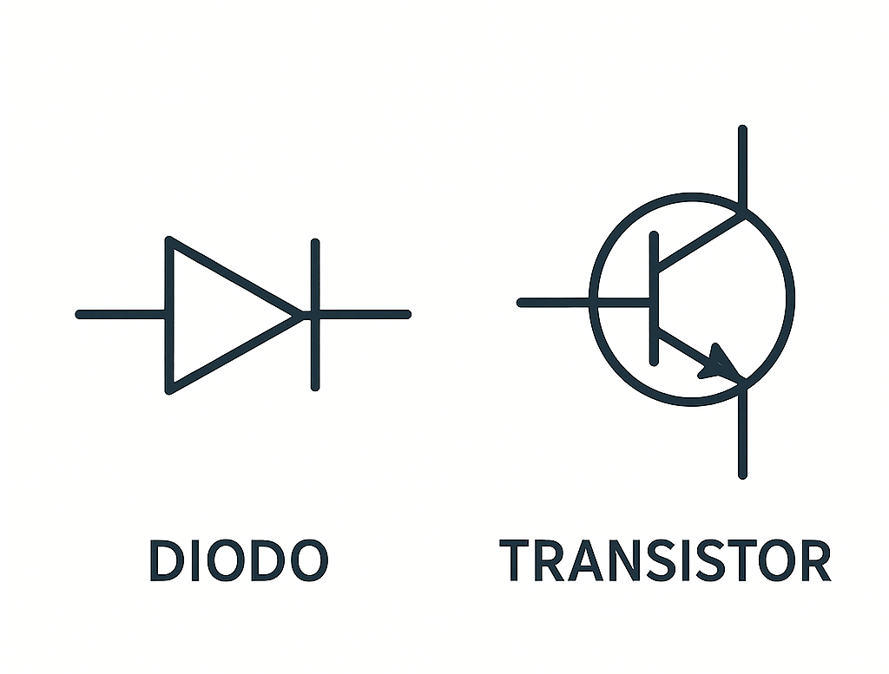
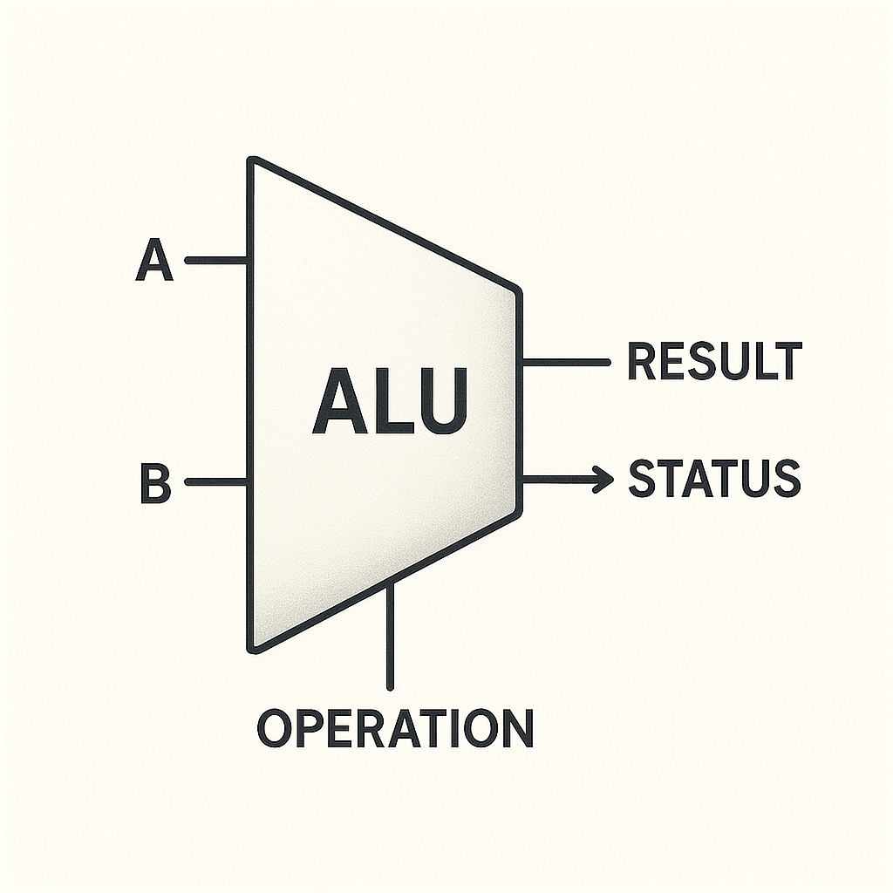

# Fundamentos de Eletrônica e Programação

_Uma Jornada da Física aos Algoritmos_

Este documento apresenta os conceitos fundamentais que conectam a eletrônica física com a programação de computadores, estabelecendo uma base sólida para compreender os sistemas digitais modernos.

Ao final deste estudo, você compreenderá como componentes eletrônicos simples evoluem para processadores complexos, e como linguagens de programação abstraem milhões de operações físicas em comandos intuitivos.

---

## Parte I: Fundamentos da Eletrônica

_Da Energia Elétrica à Inteligência Digital_

Para compreender como funcionam os computadores modernos, é necessário começar pelos fundamentos físicos que tornam toda a computação possível. Nesta primeira parte, exploraremos a distinção entre sistemas elétricos e eletrônicos, estabelecendo os conceitos necessários para o estudo.

### 1.1 A Distinção Fundamental: Elétrica versus Eletrônica

É importante compreender a diferença entre **elétrica** e **eletrônica**. Embora intimamente relacionadas, estas áreas têm focos e aplicações distintos que são fundamentais para entender.

#### **Engenharia Elétrica: A Infraestrutura da Energia**

A engenharia elétrica concentra-se no **transporte, distribuição e conversão de energia elétrica**. Seu objetivo principal é mover energia de forma eficiente e segura do ponto de geração até o ponto de consumo. Podemos pensá-la como a "infraestrutura energética" de nossa sociedade moderna.

**Componentes fundamentais da engenharia elétrica:**

<div align="center">

</div>

- **Resistor** → Controla o fluxo de corrente elétrica, limitando-a de acordo com suas especificações
- **Capacitor** → Armazena energia elétrica temporariamente, funcionando como uma "bateria instantânea"
- **Indutor** → Gera campos magnéticos e armazena energia magnética, essencial em transformadores

Estes componentes trabalham em conjunto para garantir que a energia elétrica seja utilizada de forma controlada e segura em nossas residências, indústrias e infraestrutura urbana.

#### **Eletrônica: Processamento de Informação**

A eletrônica transcende o simples transporte de energia e se concentra no **processamento de sinais e informação**. Enquanto a elétrica move energia, a eletrônica a transforma em inteligência, permitindo a criação de sistemas capazes de tomar decisões, processar dados e interagir com o mundo de maneiras complexas.

Esta é a tecnologia que torna possível a existência de computadores, smartphones, sistemas de navegação por satélite, equipamentos médicos digitais e dispositivos inteligentes em geral.

**Componentes fundamentais da eletrônica:**

<div align="center">

</div>

- **Diodo** → Atua como uma "válvula unidirecional", permitindo que a corrente flua apenas em um sentido específico
- **Transistor** → Componente fundamental da revolução digital, capaz de amplificar sinais ou funcionar como uma chave eletrônica ultrarrápida

> **Nota importante:** O transistor é uma das invenções mais transformadoras da história moderna. Cada processador moderno contém bilhões destes componentes trabalhando em conjunto para executar as operações que tornam possível desde calculadoras simples até sistemas de inteligência artificial.

### 1.2 Os Semicondutores

Os **semicondutores** são materiais com propriedades elétricas intermediárias entre condutores (como o cobre) e isolantes (como o vidro), oferecendo controle preciso sobre o fluxo de elétrons.

#### **Evolução dos Semicondutores**

A evolução dos semicondutores é uma história de inovação científica e necessidade tecnológica:

**Durante a Segunda Guerra Mundial:** Os avanços urgentes em tecnologia de radar impulsionaram pesquisas fundamentais na purificação do germânio, estabelecendo as bases teóricas e práticas para os semicondutores modernos.

**Décadas de 1950-1960:** O silício emergiu como o material preferido da indústria, não apenas por sua abundância natural (é o segundo elemento mais comum na crosta terrestre), mas também por suas propriedades superiores - maior resistência ao calor, melhor estabilidade química e custos significativamente mais baixos de processamento.

**Era dos Circuitos Integrados:** A capacidade de integrar milhões, e posteriormente bilhões, de transistores em chips cada vez menores revolucionou completamente nossa relação com a tecnologia, tornando possível dispositivos portáteis com poder computacional que superava mainframes de décadas anteriores.

> **Resultado transformador:** Esta evolução contínua nos proporcionou dispositivos eletrônicos progressivamente menores, mais rápidos, mais eficientes energeticamente e exponencialmente mais poderosos, seguindo a famosa Lei de Moore que previu a duplicação da capacidade de processamento aproximadamente a cada dois anos.

---

## Parte II: Sistemas Numéricos e Representação Digital

_A Linguagem Universal dos Computadores_

Para que os humanos possam comunicar-se efetivamente com as máquinas, e para que as máquinas possam processar informações de forma confiável, precisamos de um sistema comum de representação numérica. Esta seção explora os diferentes sistemas numéricos que formam a base de toda comunicação digital.

### 2.1 A Necessidade de Múltiplos Sistemas Numéricos

Embora o sistema **decimal** (base 10) seja intuitivo para nós devido à nossa herança evolutiva de dez dedos, a eletrônica digital opera em princípios fundamentalmente diferentes que tornam outros sistemas não apenas úteis, mas essenciais.

#### **Compreendendo as Bases Numéricas**

Cada sistema numérico possui características específicas que o tornam ideal para determinadas aplicações:

| Sistema Numérico | Base | Símbolos Disponíveis         | Aplicação Principal                      | Vantagem Distintiva                              |
| ---------------- | ---- | ---------------------------- | ---------------------------------------- | ------------------------------------------------ |
| **Decimal**      | 10   | 0, 1, 2, 3, 4, 5, 6, 7, 8, 9 | Interação humana cotidiana               | Intuitividade natural                            |
| **Binário**      | 2    | 0, 1                         | Operação interna de computadores         | Correspondência perfeita com estados eletrônicos |
| **Hexadecimal**  | 16   | 0-9, A, B, C, D, E, F        | Representação compacta de dados binários | Eficiência na codificação                        |

#### **Por que o Binário é Fundamental na Eletrônica?**

O sistema binário não foi escolhido arbitrariamente para computadores. Existe uma razão física clara para sua adoção universal:

**Simplicidade eletrônica:** Um transistor pode estar em dois estados estáveis e facilmente distinguíveis - conduzindo corrente (1) ou bloqueando corrente (0). Esta simplicidade binária torna os circuitos digitais confiáveis e resistentes a ruído.

**Confiabilidade na transmissão:** Em um mundo cheio de interferências eletromagnéticas, distinguir entre apenas dois estados é muito mais robusto do que tentar diferenciar entre dez níveis diferentes de tensão.

**Matemática simples:** Toda a álgebra booleana e lógica digital se baseia naturalmente em operações binárias, tornando o processamento de informações mais direto e eficiente.

### 2.2 Padrões de Conversão e Relações Matemáticas

#### **A Relação Especial: Potências de 2**

Uma das relações mais importantes e úteis nos sistemas digitais é que **4 bits binários equivalem exatamente a 1 dígito hexadecimal**. Esta relação existe porque 2⁴ = 16, criando uma correspondência perfeita e biunívoca.

Esta propriedade torna as conversões entre binário e hexadecimal extremamente diretas, enquanto conversões envolvendo o sistema decimal requerem cálculos mais complexos devido ao fato de que 10 não é uma potência de 2.

#### **Referência Completa de Conversões**

Para sua conveniência e estudo, preparamos uma **[tabela completa de conversão](./tabela-conversao-sistemas.md)** cobrindo todos os valores de 0 a 255 (0x00 a 0xFF), que representa o alcance completo de um byte de dados.

#### **Exemplo Prático de Conversão**

Vamos demonstrar o processo de conversão com um exemplo concreto:

```
Valor binário: 101110

Passo 1 - Agrupar em conjuntos de 4 bits (da direita para esquerda):
0010 1110

Passo 2 - Converter cada grupo para hexadecimal:
0010 = 2
1110 = E

Passo 3 - Resultado final:
Hexadecimal: 2E
Notação em programação: 0b00101110 = 0x2E = 46 (decimal)
```

> **Insight importante:** Observe como conversões binário ↔ hexadecimal são diretas e mecânicas, enquanto conversões envolvendo decimal requerem aritmética, refletindo a incompatibilidade fundamental entre bases que são potências de 2 versus base 10.---

## Parte III: Sistemas Digitais

_Da Teoria à Implementação Prática_

Nesta seção, exploraremos como os conceitos teóricos que estudamos se materializam em sistemas digitais funcionais. Compreenderemos as vantagens fundamentais dos sistemas digitais sobre seus predecessores analógicos e investigaremos os princípios de sincronização que tornam possível a coordenação de milhões de operações simultâneas.

### 3.1 A Revolução Digital: Analógico versus Digital

A transição dos sistemas analógicos para digitais representa uma das mudanças tecnológicas mais significativas da história moderna. Para compreender completamente esta revolução, precisamos examinar as características fundamentais de cada abordagem.

#### **Sistemas Analógicos: A Representação Contínua**

Os sistemas analógicos processam sinais que podem assumir **infinitos valores dentro de um intervalo contínuo**. Um exemplo clássico é um microfone analógico tradicional, onde a pressão sonora é convertida diretamente em variações proporcionais de tensão elétrica.

**Características dos sistemas analógicos:**

- **Representação natural:** Sinais analógicos mantêm uma correspondência direta com fenômenos físicos
- **Resolução teóricamente infinita:** Não há limitação discreta nos valores que podem ser representados
- **Vulnerabilidade ao ruído:** Qualquer interferência se soma permanentemente ao sinal original

#### **Sistemas Digitais: A Precisão Discreta**

Os sistemas digitais, por outro lado, operam exclusivamente com **valores discretos e predefinidos** - tipicamente representados pelos estados binários 0 e 1. Esta aparente limitação torna-se, na verdade, uma poderosa vantagem.

**Características dos sistemas digitais:**

- **Imunidade ao ruído:** Pequenas interferências não afetam a interpretação do sinal
- **Reprodutibilidade perfeita:** Cópias digitais são idênticas ao original
- **Processamento complexo:** Operações matemáticas e lógicas sofisticadas são facilmente implementadas

#### **Análise Comparativa Detalhada**

| Aspecto                     | **Sistemas Analógicos**                                | **Sistemas Digitais**                                            |
| --------------------------- | ------------------------------------------------------ | ---------------------------------------------------------------- |
| **Representação de sinais** | Contínua (infinitos valores possíveis)                 | Discreta (valores específicos: 0 e 1)                            |
| **Tolerância a ruído**      | Muito sensível - ruído se integra permanentemente      | Altamente resistente - ruído é filtrado                          |
| **Exemplo representativo**  | Microfone com diafragma, vinil, termômetro de mercúrio | Processador de computador, CD digital, sensor digital            |
| **Principal vantagem**      | Representação natural e direta de fenômenos físicos    | Confiabilidade alta e precisão mantida                           |
| **Limitação principal**     | Degradação cumulativa e sensibilidade a interferências | Necessidade de conversão A/D para interfacear com o mundo físico |

> **Por que a abordagem digital triunfou?** A resposta reside na robustez fundamental dos sistemas digitais. Quando um sinal precisa apenas ser distinguido entre dois estados bem definidos (próximo de 0V ou próximo de 5V, por exemplo), pequenas interferências elétricas não conseguem corromper a informação. Esta resistência a ruído torna possível a transmissão confiável de dados através de longas distâncias e múltiplos estágios de processamento.

### 3.2 Sincronização em Sistemas Digitais: A Importância do Tempo

Em sistemas digitais complexos, milhões ou bilhões de operações podem ocorrer simultaneamente. Para que este processo funcione de forma coordenada e previsível, são necessários mecanismos de sincronização temporal.

#### **Sistemas Síncronos: A Orquestra Digital**

Imagine uma orquestra sinfônica onde dezenas de músicos devem tocar em perfeita harmonia. O maestro usa uma batuta para manter todos sincronizados. Nos sistemas digitais síncronos, o **sinal de clock** desempenha o papel do maestro.

**Características dos sistemas síncronos:**

- **Clock central:** Um sinal de referência temporal coordena todas as operações
- **Operações determinísticas:** Todas as ações ocorrem em momentos precisos e previsíveis
- **Sincronização global:** Todos os componentes "marcham no mesmo compasso"
- **Prevenção de conflitos:** A temporização elimina condições de corrida entre sinais
- **Simplicidade de projeto:** O comportamento temporal é previsível e analisável

**Vantagens práticas:**

- Design mais simples e sistemático
- Depuração facilitada - problemas são reproduzíveis
- Garantia de estabilidade temporal
- Facilita a integração de múltiplos componentes

#### **Sistemas Assíncronos: A Eficiência Adaptativa**

Sistemas assíncronos operam sem um clock central, permitindo que diferentes partes funcionem em suas próprias velocidades naturais. Cada operação inicia quando suas condições de entrada estão satisfeitas.

**Características dos sistemas assíncronos:**

- **Ausência de clock global:** Cada subsistema opera em seu próprio ritmo
- **Operações orientadas por eventos:** Processamento inicia quando dados estão disponíveis
- **Potencial para maior velocidade:** Eliminação da limitação imposta pela frequência fixa de clock
- **Complexidade de projeto:** Requer cuidadosa análise de timing e dependências
- **Operação heterogênea:** Diferentes seções podem operar em velocidades completamente distintas

**Trade-offs importantes:**

- Maior eficiência energética potencial (componentes inativos consomem menos)
- Design significativamente mais complexo
- Dificuldades na depuração e verificação
- Maior suscetibilidade a condições de corrida imprevistas

---

## Parte IV: Lógica Digital e Processamento

_Construindo Inteligência a Partir de Componentes Simples_

A lógica digital representa a ponte fundamental entre os componentes físicos que estudamos e a capacidade de processamento que caracteriza os computadores modernos. Nesta seção, descobriremos como operações lógicas simples se combinam para criar sistemas capazes de realizar cálculos complexos e tomar decisões.

### 4.1 Portas Lógicas: Os Fundamentos da Computação

As **portas lógicas** são os blocos de construção fundamentais de toda computação digital. Cada porta é fisicamente construída usando transistores, mas conceptualmente funciona como uma unidade lógica que toma decisões baseadas em regras específicas.

#### **Compreendendo as Portas Fundamentais**

Cada porta lógica implementa uma função matemática específica da álgebra booleana, nomeada em homenagem ao matemático George Boole, que formalizou esta área no século XIX.

| Porta Lógica | Símbolo | Operação     | Condição para Saída = 1               | Analogia no Mundo Real                                                |
| ------------ | ------- | ------------ | ------------------------------------- | --------------------------------------------------------------------- |
| **AND**      | &       | E lógico     | **Todas** as entradas devem ser 1     | Porta com múltiplas chaves - só abre se todas estiverem ligadas       |
| **OR**       | \|      | OU lógico    | **Pelo menos uma** entrada deve ser 1 | Múltiplos interruptores em paralelo - qualquer um pode acender a luz  |
| **NOT**      | ~       | Negação      | Entrada é 0 (inverte o valor)         | Interruptor inversor - liga quando está desligado                     |
| **XOR**      | ⊕       | OU exclusivo | **Exatamente uma** entrada é 1        | Dois interruptores de escada - luz muda quando qualquer um é alterado |
| **NAND**     | ~&      | AND negado   | **Nem todas** as entradas são 1       | Porta AND seguida de NOT                                              |
| **NOR**      | ~\|     | OR negado    | **Nenhuma** entrada é 1               | Porta OR seguida de NOT                                               |

> **Nota importante:** As portas NAND e NOR são chamadas de "universais" porque qualquer função lógica pode ser construída usando apenas uma delas. Esta propriedade torna possível fabricar processadores usando apenas um tipo de circuito básico, simplificando a produção.

#### **Exemplos Práticos de Aplicação**

**Porta AND - Sistema de Segurança:**

```
Entrada A: Cartão válido (1) ou inválido (0)
Entrada B: Senha correta (1) ou incorreta (0)
Saída: Acesso liberado (1) apenas se ambos estiverem corretos
```

**Porta XOR - Detector de Mudança:**

```
Entrada A: Estado anterior de um sensor
Entrada B: Estado atual do sensor
Saída: Indica se houve mudança (1) ou não (0)
```

### 4.2 Evolução Computacional: Digital versus Analógico

Para apreciar completamente a elegância dos sistemas digitais modernos, é valuable compreender o contexto histórico e as alternativas que foram exploradas.

#### **Computadores Digitais: A Abordagem Vencedora**

Os computadores digitais modernos baseiam toda sua operação no processamento de informações codificadas em formato binário. Esta abordagem oferece vantagens fundamentais que explicam sua dominância universal:

**Características distintivas:**

- **Processamento binário:** Todas as operações reduzem-se a manipulações de 0s e 1s
- **Imunidade a ruído:** Pequenas flutuações elétricas não corrompem os dados
- **Flexibilidade de programação:** O mesmo hardware pode executar infinitas variedades de software
- **Armazenamento confiável:** Dados mantêm sua integridade através de múltiplas operações de leitura/escrita
- **Escalabilidade:** Sistemas podem crescer em complexidade sem perda de confiabilidade

#### **Computadores Analógicos: O Caminho Não Trilhado**

Embora hoje sejam raros, os computadores analógicos foram importantes historicamente e ainda encontram aplicações especializadas:

**Características e aplicações históricas:**

- **Processamento de sinais contínuos:** Operavam diretamente com voltagens variáveis
- **Especialização científica:** Excepcionais para resolver equações diferenciais em tempo real
- **Vulnerabilidade ao ruído:** Resultados degradavam com interferências elétricas
- **Limitações de programação:** Cada problema requeria reconfiguração física do hardware

**Aplicações contemporâneas:** Ainda são utilizados em algumas situações onde o processamento analógico em tempo real oferece vantagens, como em certos tipos de simulação física e processamento de sinais de alta velocidade.

### 4.3 Aritmética Digital: Construindo Matemática com Lógica

Uma das características importantes da engenharia digital é a capacidade de realizar operações matemáticas complexas usando apenas operações lógicas simples.

#### **O Somador de 1 Bit: Fundamento da Aritmética Digital**

O **Half Adder** (somador de meio bit) demonstra como operações aritméticas básicas podem ser implementadas usando portas lógicas. Esta é uma das estruturas mais fundamentais em qualquer processador.

| Entrada A | Entrada B | **Soma (XOR)** | **Carry (AND)** | Interpretação              |
| --------- | --------- | -------------- | --------------- | -------------------------- |
| 0         | 0         | 0              | 0               | 0 + 0 = 0                  |
| 0         | 1         | 1              | 0               | 0 + 1 = 1                  |
| 1         | 0         | 1              | 0               | 1 + 0 = 1                  |
| 1         | 1         | 0              | 1               | 1 + 1 = 10₂ (2 em decimal) |

**Análise do exemplo crítico:** 1 + 1 = 10₂

- A soma resulta em 0 (bit menos significativo)
- O carry resulta em 1 (bit mais significativo)
- Juntos formam "10" em binário, que representa 2 em decimal

> **Princípio fundamental:** Esta demonstração ilustra como operações matemáticas arbitrariamente complexas - multiplicação, divisão, exponenciação, funções trigonométricas - podem ser decompostas em sequências de operações lógicas simples executadas por portas básicas.

#### **Escalabilidade: De Bits a Processadores**

O mesmo princípio se estende para operações mais complexas:

- **Full Adders:** Somadores completos que consideram carry de operações anteriores
- **Multiplicadores:** Redes de somadores organizados para realizar multiplicação
- **ALUs completas:** Unidades que combinam múltiplas operações aritméticas e lógicas

### 4.4 A Unidade Lógica e Aritmética: Coração do Processamento

A **ALU (Arithmetic Logic Unit)** representa a materialização física dos conceitos que estivemos estudando. É literalmente o "cérebro matemático" de qualquer processador, onde todas as operações computacionais fundamentais são executadas.

<div align="center">

</div>

#### **Anatomia da ALU**

**Componentes essenciais:**

- **Entradas A e B:** Canais pelos quais os dados a serem processados chegam à unidade
- **Seletor de operação:** Conjunto de sinais de controle que determina qual operação específica será executada
- **Saída de resultado:** Canal por onde o resultado da operação é disponibilizado
- **Flags de status:** Sinais adicionais que fornecem informações sobre a operação (overflow, carry, zero, etc.)

#### **Operação Prática**

Quando você escreve uma instrução como `ADD A, B` em linguagem assembly, uma cascata de eventos ocorre:

1. **Decodificação:** O processador identifica que uma operação de soma é necessária
2. **Configuração:** O seletor de operação da ALU é configurado para "adição"
3. **Carregamento:** Os valores A e B são fornecidos às entradas da ALU
4. **Processamento:** A rede de portas lógicas executa a operação de soma
5. **Resultado:** O valor resultante é disponibilizado na saída, junto com flags relevantes

> **Conexão prática:** Esta sequência demonstra como conceitos abstratos de programação (como `A + B` em uma linguagem de alto nível) eventualmente se materializam em operações físicas concretas executadas por bilhões de transistores trabalhando em conjunto coordenado.

---

## Parte V: Software e Sistemas Operacionais

_Construindo Pontes entre Hardware e Aplicações_

Nesta seção final, exploraremos como múltiplas camadas de abstração transformam operações de hardware de baixo nível em interfaces intuitivas que programadores e usuários podem utilizar efetivamente. Compreenderemos a evolução dos sistemas operacionais e seu papel crucial na democratização da computação.

### 5.1 A Evolução das Camadas de Abstração

#### **A Pirâmide da Complexidade Computacional**

A computação moderna é caracterizada por um conjunto de camadas de abstração cuidadosamente construídas, onde cada nível oculta a complexidade dos níveis inferiores enquanto fornece uma interface mais simples para os níveis superiores.

```
Aplicações de Alto Nível (Python, JavaScript, Java)
                    ↓
      Sistemas Operacionais Modernos (Windows, Linux, macOS)
                    ↓
           Firmwares e Sistemas Embarcados
                    ↓
              Hardware Puro (Transistores, ALUs)
```

**Evolução histórica da abstração:**

| Fase                                | Características                                     | Exemplo Representativo                              | Complexidade de Programação                          |
| ----------------------------------- | --------------------------------------------------- | --------------------------------------------------- | ---------------------------------------------------- |
| **Hardware Puro**                   | Controle direto de cada componente                  | Primeiros computadores mainframe                    | Extremamente alta - cada operação deve ser explícita |
| **Microcontroladores**              | Firmware básico, controle ainda próximo ao hardware | Arduino, sistemas embarcados                        | Alta - programador gerencia recursos diretamente     |
| **Sistemas Embarcados**             | OS minimalista, algumas abstrações                  | Videogames clássicos, eletrodomésticos inteligentes | Moderada - algumas funções automáticas               |
| **Sistemas Operacionais Completos** | Camada robusta de abstração                         | Computadores pessoais, servidores, smartphones      | Baixa - foco na lógica da aplicação                  |

### 5.2 Paradigmas de Compilação e Execução

A forma como o código é transformado de linguagem humana em operações de hardware varia drasticamente dependendo da presença e sofisticação do sistema operacional subjacente.

#### **Desenvolvimento sem Sistema Operacional**

**Contexto:** Microcontroladores, sistemas embarcados, videogames clássicos

Neste paradigma, o código desenvolvido comunica-se diretamente com o hardware, oferecendo controle total mas exigindo responsabilidade total do programador.

**Características distintivas:**

- **Acesso direto:** O programa manipula registradores, pinos de I/O e periféricos sem intermediação
- **Controle absoluto:** Cada ciclo de clock e recurso de hardware é gerenciado explicitamente
- **Responsabilidade total:** O programador deve implementar todas as funcionalidades básicas (timers, comunicação, gerenciamento de memória)
- **Eficiência máxima:** Não há overhead de sistema operacional consumindo recursos

**Vantagens:** Performance otimizada, uso eficiente de recursos limitados, comportamento determinístico
**Desafios:** Complexidade de desenvolvimento, necessidade de conhecimento profundo de hardware, dificuldade de portabilidade

#### **Desenvolvimento com Sistema Operacional Simples**

**Contexto:** Consoles de videogame, dispositivos especializados

Sistemas operacionais básicos fornecem algumas abstrações fundamentais, mas mantêm o programador relativamente próximo ao hardware.

**Características distintivas:**

- **Abstrações seletivas:** Rotinas pré-construídas para operações comuns (gráficos, som, entrada)
- **Bibliotecas especializadas:** APIs específicas do hardware disponíveis para tarefas complexas
- **Gerenciamento limitado:** Algumas funções automáticas, mas controle manual ainda necessário
- **Performance otimizada:** Abstrações mínimas preservam eficiência

**Exemplos históricos:** PlayStation 1, Super Nintendo, sistemas de automação industrial

#### **Desenvolvimento com Sistema Operacional Completo**

**Contexto:** Computadores pessoais, servidores, smartphones modernos

Sistemas operacionais modernos criam uma camada de abstração robusta e abrangente que isola aplicações das complexidades do hardware.

**Características distintivas:**

- **Abstração completa:** Aplicações interagem com APIs padronizadas em vez de hardware específico
- **Gerenciamento automático:** Memória, processos, arquivos e dispositivos são gerenciados transparentemente
- **Portabilidade:** O mesmo código pode executar em hardware diverso
- **Segurança:** Isolamento entre aplicações e proteção do sistema

**Arquitetura em camadas:**

```
Aplicação → API do Sistema → Drivers de Dispositivo → Hardware
```

### 5.3 O Papel dos Drivers na Abstração de Hardware

#### **Drivers: Tradutores Universais**

Os drivers de dispositivo representam uma das inovações mais importantes na evolução dos sistemas operacionais. Eles funcionam como tradutores bidirecionais entre as APIs padronizadas do sistema operacional e as especificidades únicas de cada componente de hardware.

**Função fundamental:**

- **Padronização:** Convertem operações específicas de hardware em interfaces uniformes
- **Isolamento:** Protegem aplicações das particularidades de implementação de hardware
- **Modularidade:** Permitem adicionar novo hardware sem modificar aplicações existentes
- **Manutenibilidade:** Atualizações de hardware requerem apenas novos drivers, não reescrita de software

#### **Fluxo de Operação com Drivers**

**Sistema com camada simples:**

```
Programa → Hardware (controle direto, hardware-específico)
```

**Sistema com camada complexa:**

```
Programa → Sistema Operacional → Driver Específico → Hardware
```

Esta arquitetura em camadas explica por que o mesmo programa pode imprimir em qualquer impressora ou reproduzir áudio em qualquer placa de som - o driver traduz as chamadas padronizadas do SO para os comandos específicos que cada hardware compreende.

> **Compilação direcionada:** O tipo de sistema alvo determina fundamentalmente como o código é compilado. Código para sistemas operacionais completos utiliza APIs e bibliotecas do sistema, enquanto código para microcontroladores acessa diretamente registradores e interfaces de hardware específicos.

---

## Conclusão: A Jornada da Matéria ao Pensamento

Esta exploração percorreu o caminho desde os fundamentos físicos da matéria até as abstrações mais elevadas da programação moderna. Ao final deste estudo, você deve ter compreendido as conexões que permeiam todo o espectro da computação.

### Síntese dos Conceitos Fundamentais

Nossa exploração revelou como:

1. **Componentes eletrônicos básicos** evoluem através de múltiplas camadas de abstração para se tornarem **sistemas computacionais complexos** capazes de executar bilhões de operações por segundo

2. **Sistemas numéricos diversificados** facilitam a **comunicação efetiva entre humanos e máquinas**, permitindo que conceitos humanos sejam traduzidos em operações que o hardware pode executar

3. **Portas lógicas simples** se combinam de formas intrincadas para construir **processadores poderosos** capazes de executar qualquer algoritmo computável

4. **Camadas progressivas de abstração** tornam a programação **progressivamente mais acessível e intuitiva**, democratizando o acesso à tecnologia de computação

5. **Interfaces diversificadas e flexíveis** atendem **necessidades específicas e variadas** de diferentes domínios de aplicação, desde sistemas embarcados até aplicações de nuvem

### Perspectivas para Desenvolvimento Futuro

O conhecimento adquirido neste estudo fornece a base sólida necessária para:

- **Programação mais eficiente:** Compreender os fundamentos permite escrever código que utiliza recursos de forma mais inteligente
- **Resolução de problemas:** Entender como sistemas funcionam internamente facilita o diagnóstico e correção de problemas complexos
- **Escolhas arquiteturais informadas:** Conhecimento de trade-offs permite decisões mais adequadas sobre tecnologias e abordagens
- **Inovação tecnológica:** Fundamentos sólidos são essenciais para criar soluções genuinamente novas

### Convite à Exploração Contínua

A computação é um campo em constante evolução, onde novos paradigmas, tecnologias e possibilidades emergem continuamente. Os fundamentos que exploramos neste livro permanecem relativamente estáveis, mas suas aplicações e combinações continuam a expandir os horizontes do que é possível.

> **Próximos passos recomendados:** Aplique estes conceitos fundamentais em projetos práticos de programação e eletrônica, experimentando com diferentes tecnologias e abordagens. A teoria adquire seu verdadeiro significado quando aplicada na solução de problemas reais e na criação de sistemas funcionais.

### Recursos para Aprofundamento

**Documentos relacionados neste compêndio:**

- **[Interfaces de Usuário e Terminal](./interfaces-terminal.md)** - Aplicação prática dos conceitos de abstração através de interfaces de linha de comando e personalização de ambientes de desenvolvimento

- **[Controle de Versão com Git](./git-controle-versao.md)** - Gerenciamento sistemático de código e colaboração em projetos de software, aplicando princípios de organização digital

- **[Tabela de Conversão de Sistemas Numéricos](./tabela-conversao-sistemas.md)** - Referência completa para conversões entre sistemas binário, decimal e hexadecimal

Esta foundation teórica, combinada com exploração prática, fornecerá a você as ferramentas intelectuais necessárias para navegar e contribuir efetivamente no mundo em constante evolução da tecnologia da informação.
